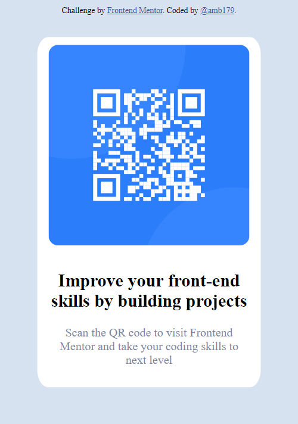

# Frontend Mentor - QR code component solution

This is a solution to the [QR code component challenge on Frontend Mentor](https://www.frontendmentor.io/challenges/qr-code-component-iux_sIO_H). Frontend Mentor challenges help you improve your coding skills by building realistic projects. 

## Table of contents

  - [Screenshot](#screenshot)
  - [Links](#links)
- [My process](#my-process)
  - [Built with](#built-with)
  - [What I learned](#what-i-learned)
  - [Useful resources](#useful-resources)
- [Author](#author)  - [Useful resources](#useful-resources)


### Screenshot





### Links

- Solution URL: (https://github.com/amb179/qr-code)
- Live Site URL: (https://roaring-pavlova-9db072.netlify.app/)

## My process
I decided to build the card on html first, using div.card and adding the image and the text within the same div. Because the card and the background were the same color, I added the background color hsl(212, 45%, 89%) to the body, then made the card's background white. Now knowing the card's shape, I adjusted it to a favorable size, applied border radius, adjusted the size of the image, and changed the text color of the bottom text. The card was now ready, but I struggled to center it and keep it centered after resizing the page, so I took to Google for help and found a new method to horizontally and vertically center an element.

### Built with

- Semantic HTML5 markup
- CSS custom properties

### What I learned

I learned how to use margin and transform to center an element. Previously, I would use position: relative, and center using just left, right, etc; however this new method I learned allows the element to stay centered on the page despite resizing it.

```css
.learned-this-css {
  position: absolute;
  top: 50%;
  left: 50%;
  margin-right: -50%;
  transform: translate(-50%, -50%)
}
```

### Useful resources

- [w3.org](https://www.w3.org/Style/Examples/007/) - This website helped me as I was struggling with centering the qr card. I found help in the horizontal and vertical centering section.

## Author

- Website - ()
- Frontend Mentor - (https://www.frontendmentor.io/profile/amb179)
- Github - (https://github.com/amb179?tab=repositories)
- LinkedIn - (https://www.linkedin.com/in/amber-sanchez-/)

